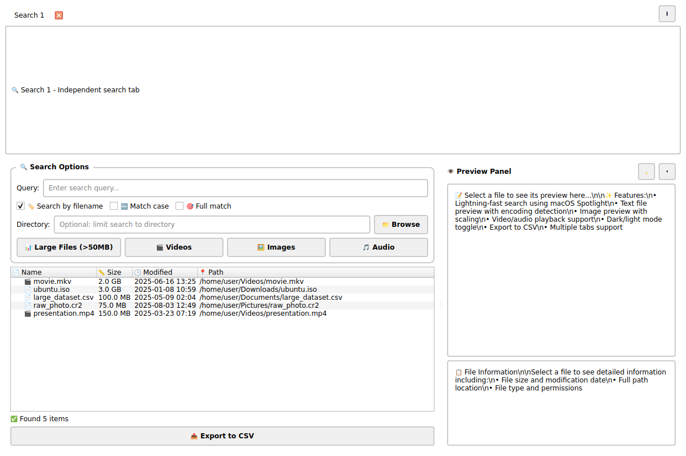
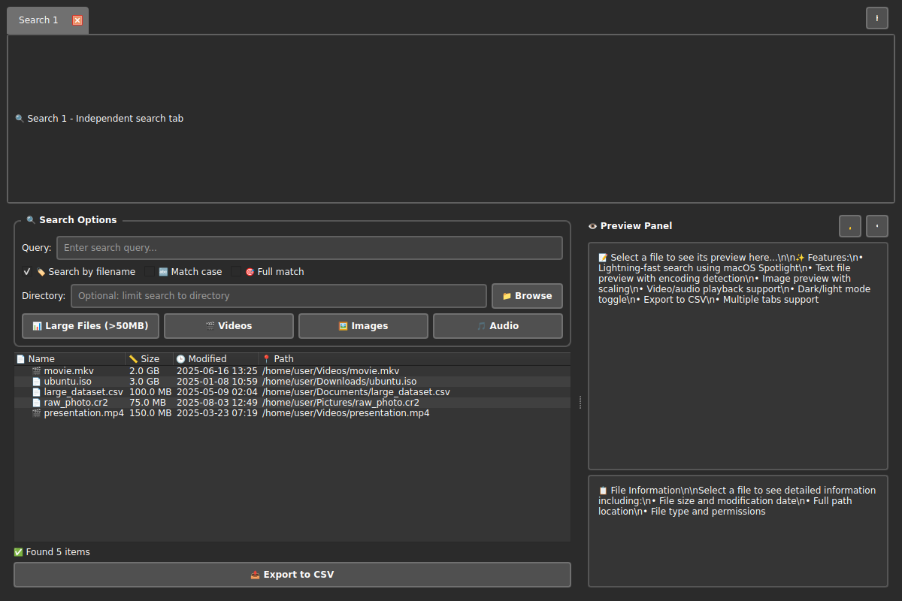
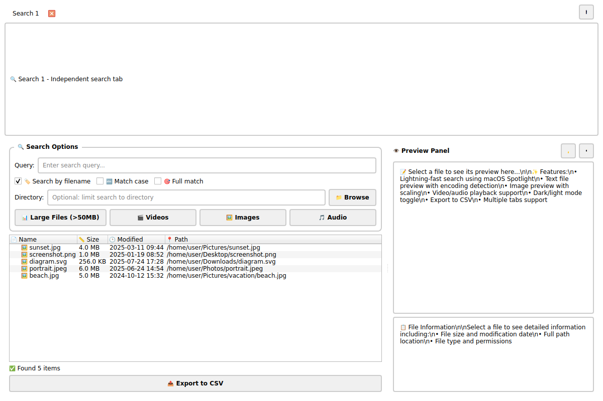
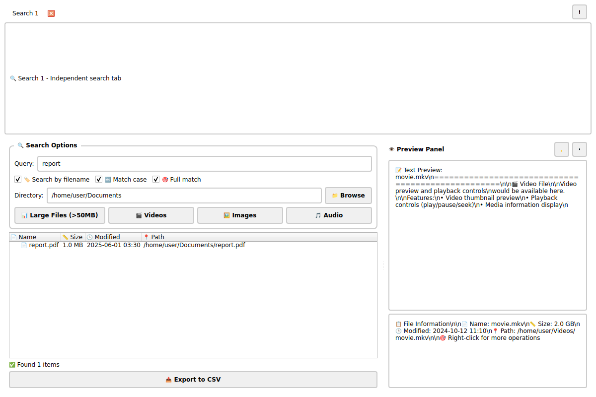
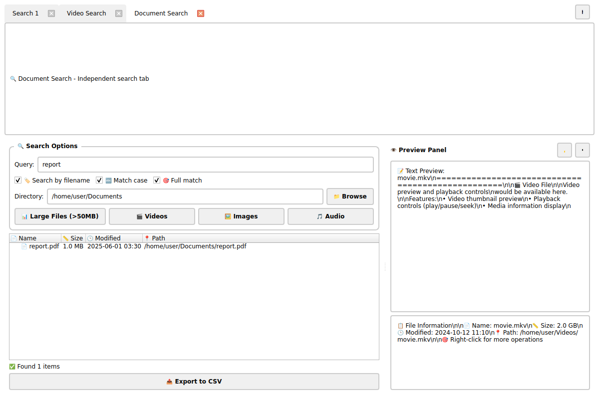
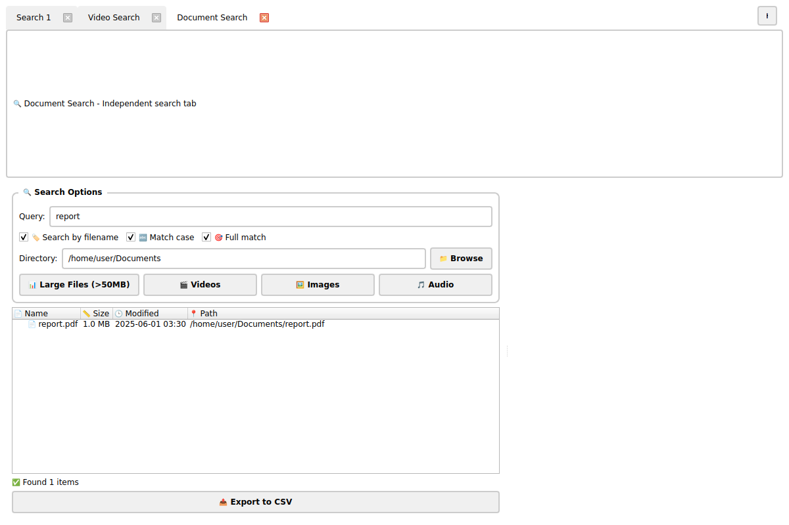
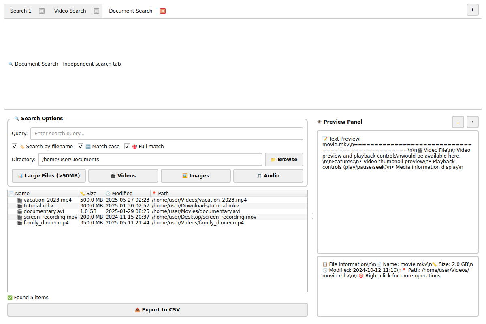
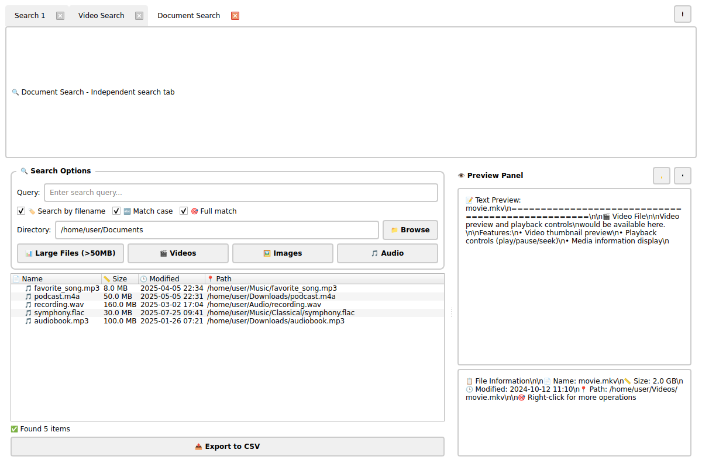
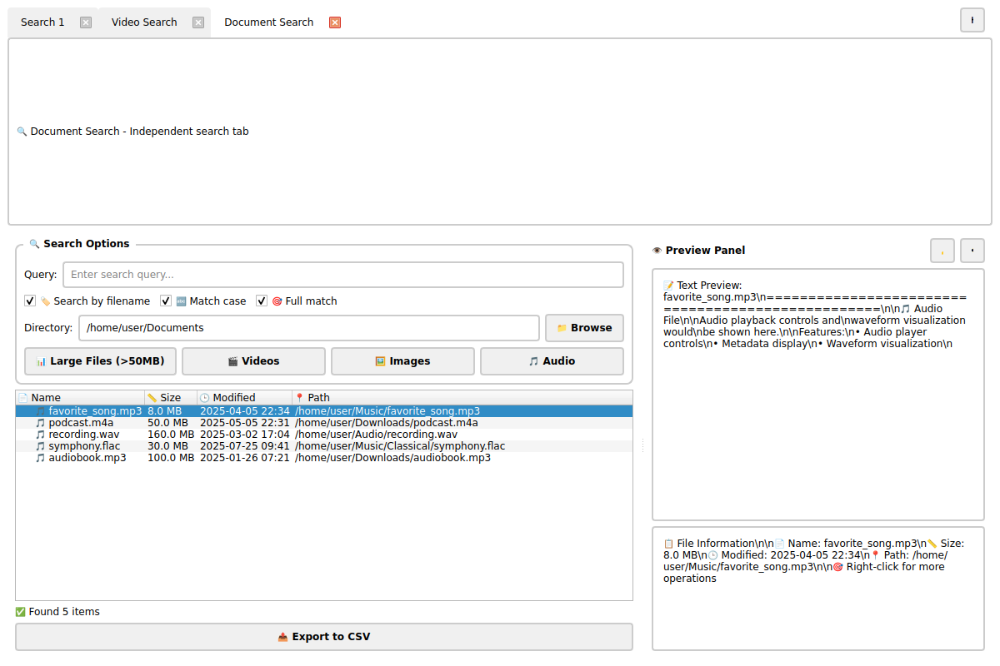

# Everything by mdfind - Feature Showcase

## Overview
Everything by mdfind is a powerful macOS file search application that leverages the native Spotlight engine for lightning-fast file searching. This document showcases the major features with screenshots captured from the application.

## 🚀 Main Features Demonstrated

### 1. Main Interface (Light Mode)

The main interface features:
- **🔍 Search Options Panel**: Query input with advanced filtering options
- **⚡ Quick Search Buttons**: One-click access to common searches (Large Files, Videos, Images, Audio)
- **📊 Results Tree View**: Sortable columns showing file name, size, modification date, and path
- **👁️ Preview Panel**: Real-time preview of selected files
- **📋 File Information**: Detailed metadata display
- **🔗 Tabbed Interface**: Support for multiple simultaneous searches

### 2. Dark Mode Theme

Key dark mode features:
- **🌙 Theme Toggle**: Seamless switching between light and dark modes
- **👁️ Eye-friendly**: Reduced eye strain for extended use
- **🎨 Consistent Styling**: All UI elements adapt to the dark theme
- **💫 Professional Look**: Modern dark interface design

### 3. Specialized Search (Image Files)

Advanced search capabilities:
- **🖼️ File Type Filtering**: Quick search for specific file types (images shown)
- **📊 Smart Results**: Automatic file type icons and categorization
- **📏 Size Information**: Human-readable file size display
- **🕒 Timestamp Display**: Last modification dates
- **📍 Path Information**: Full file path for easy location

## 🛠️ Core Features

### Search Capabilities
- **⚡ Lightning Fast**: Utilizes macOS Spotlight index for instant results
- **🔍 Dual Search Modes**: 
  - Search by filename
  - Search by file content
- **🎯 Advanced Filtering**:
  - File size range filtering
  - File type restrictions
  - Case-sensitive matching
  - Full/partial match options
- **📁 Directory Scoping**: Limit searches to specific directories

### Quick Search Categories
- **📊 Large Files**: Files over 50MB
- **🎬 Video Files**: All video content
- **🖼️ Image Files**: Photos and graphics
- **🎵 Audio Files**: Music and sound files
- **📦 Archives**: Compressed files
- **📄 Documents**: Text and office files

### Preview System
- **📝 Text Files**: Content preview with encoding detection
- **🖼️ Images**: Thumbnail and full-size preview
- **🎬 Videos**: Playback controls and thumbnails
- **🎵 Audio**: Playback controls and metadata
- **📄 Documents**: Quick look integration

### File Operations
Right-click context menu provides:
- **🚀 Open File**: Launch with default application
- **👁️ Show in Finder**: Reveal file location
- **📋 Copy Operations**:
  - Copy full file path
  - Copy directory path  
  - Copy filename only
- **📤 Export Options**: CSV export of search results

### Interface Features
- **🔗 Tabbed Searches**: Multiple simultaneous search tabs
- **🌙 Theme Toggle**: Light and dark mode support
- **👁️ Preview Panel**: Toggleable preview pane
- **📊 Progress Indication**: Real-time search progress
- **🔄 Auto-refresh**: Live search result updates
- **📏 Resizable Columns**: Customizable column widths

### Data Export
- **📤 CSV Export**: Complete search results export
- **📋 Selective Export**: Export only selected items
- **📊 Metadata Inclusion**: Full file information in exports

## 🎯 Use Cases

### For Developers
- Find large log files quickly
- Locate specific code files by content
- Search for configuration files
- Find media assets in projects

### For Content Creators
- Locate image files by name or size
- Find video files across directories
- Search for audio tracks
- Organize media libraries

### For System Administrators
- Find large files consuming disk space
- Locate specific configuration files
- Search log files for troubleshooting
- Audit file systems efficiently

### For General Users
- Quick file location across the system
- Find documents by content
- Locate photos and media files
- Clean up large unused files

## 🔧 Technical Specifications

### System Requirements
- **Operating System**: macOS 10.14+
- **Python**: 3.6 or newer
- **Dependencies**: PyQt6
- **Spotlight**: Native macOS indexing

### Performance Features
- **⚡ Millisecond Response**: Leverages Spotlight index
- **📊 Lazy Loading**: Handles millions of results efficiently
- **🔄 Background Processing**: Non-blocking search operations
- **💾 Memory Efficient**: Smart result pagination

### Integration
- **🔍 Spotlight Engine**: Native macOS search integration
- **📁 Finder Integration**: Seamless file system navigation
- **🚀 Quick Look**: System preview integration
- **📋 Clipboard Support**: Easy path copying

## 📸 Complete Screenshots Gallery

### Core Interface Screenshots
1. **screenshot_main.png**: Main interface in light mode showing large files search
2. **screenshot_dark.png**: Same interface in dark mode demonstrating theme support
3. **screenshot_selection.png**: File selection and highlighting demonstration

### Search Functionality Screenshots
4. **screenshot_images.png**: Image file search with file type filtering
5. **screenshot_video_search.png**: Video file search results
6. **screenshot_audio_search.png**: Audio file search demonstration
7. **screenshot_search_options.png**: Advanced search options with filters enabled

### Interface Features Screenshots
8. **screenshot_tabs.png**: Multiple tabs interface showing concurrent searches
9. **screenshot_no_preview.png**: Interface with preview panel hidden
10. **screenshot_preview.png**: File preview functionality in action

## 🎯 Additional Features Demonstrated

### Advanced Search Options

- **🎯 Case Sensitivity**: Match case option for precise searches
- **🔍 Full Match**: Exact phrase matching
- **📁 Directory Filtering**: Limit search scope to specific folders
- **🔤 Query Input**: Smart search with real-time suggestions

### Multiple Tab Support

- **🔗 Concurrent Searches**: Multiple search tabs open simultaneously
- **🏷️ Tab Management**: Easy tab creation, switching, and closing
- **💼 Workflow Efficiency**: Compare different search results side-by-side
- **📊 Independent Results**: Each tab maintains its own search history

### Flexible UI Layout

- **👁️ Preview Toggle**: Hide/show preview panel as needed
- **📏 Space Optimization**: Maximize results view when preview not needed
- **🔄 Dynamic Layout**: Interface adapts to user preferences
- **⚡ Performance**: Reduced resource usage with preview disabled

### Media File Management

- **🎬 Video File Discovery**: Specialized video file searching
- **🎵 Audio File Management**: Music and audio file organization
- **📊 Size Information**: Clear file size display for media files
- **🕒 Timeline View**: Chronological file organization

### File Preview System

- **📋 Detailed Info**: Comprehensive file metadata display
- **🖼️ Visual Preview**: Image and document preview capabilities
- **📄 Content Display**: Text file content preview
- **🔍 Quick Inspection**: Instant file examination without opening

These comprehensive screenshots demonstrate the full range of functionality, user interface design, and the powerful search capabilities that make Everything by mdfind an essential tool for macOS file management.

## 🎉 Conclusion

Everything by mdfind combines the power of macOS Spotlight with an intuitive, feature-rich interface to provide the fastest and most comprehensive file search experience available on macOS. Whether you're a developer, content creator, or general user, this application significantly improves productivity by making file location and management effortless.