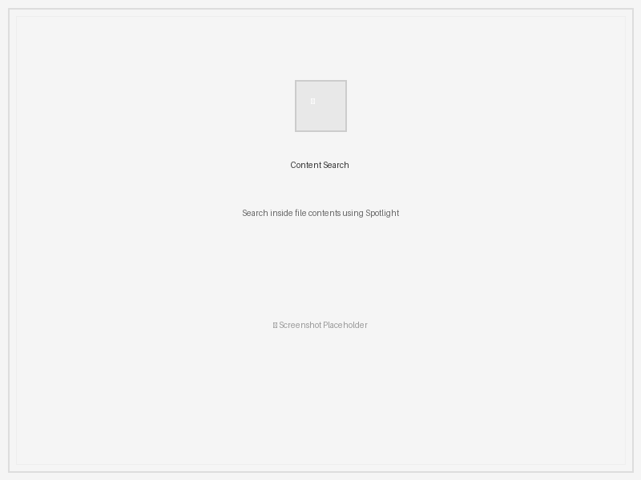

[English](README.md) | [中文](README_CN.md) | [한국어](README_KO.md) | [日本語](README_JP.md)

# Everything by mdfind

A powerful and efficient file search tool for macOS, leveraging the native Spotlight engine for lightning-fast results.

## Key Features

Everything by mdfind offers a comprehensive suite of features designed to make file searching on macOS both powerful and intuitive.

### 🔍 Lightning-Fast Search Engine
*   **Blazing Fast Search:** Utilizes the macOS Spotlight index for near-instantaneous file searching
*   **Flexible Search Options:** Search by file name or content to quickly locate the files you need
*   **Smart Content Indexing:** Searches inside file contents using native Spotlight capabilities


*The clean, intuitive interface provides instant access to powerful search capabilities*

### 🎛️ Advanced Search Controls  
*   **Advanced Filtering:** Refine your searches with comprehensive filters:
    *   File size range (minimum and maximum size in bytes)
    *   Specific file extensions (e.g., `pdf`, `docx`)
    *   Case-sensitive matching
    *   Full or partial match options
*   **Directory-Specific Search:** Limit your search to a specific directory for focused results


*Advanced filtering options help you narrow down search results precisely*

### 📱 Multi-Tab Interface
*   **Multi-Tab Search Interface:** Work with multiple search sessions simultaneously:
    *   Create new tabs for different search queries
    *   Close, reorder, and manage tabs with right-click context menu
    *   Independent search results and settings per tab
    *   Chrome-like tab experience with scroll buttons for many tabs


*Work on multiple searches simultaneously with the intuitive tab system*

### 👁️ Rich Preview System
*   **Rich Preview:** Preview various file types directly in the application:
    *   Text files with automatic encoding detection
    *   Images (JPEG, PNG, GIF with animation support, BMP, WEBP, HEIC)
    *   SVG files with proper scaling and centering
    *   Video files with playback controls
    *   Audio files with metadata display


*Preview images directly within the application with metadata information*


*Built-in video preview with full media controls*

### 🎵 Integrated Media Player
*   **Integrated Media Player:**
    *   Video and audio playback with standard controls
    *   Standalone player window for media files
    *   Continuous playback mode
    *   Volume control and mute option


*Full-featured media player integrated into the search results*

### ⚡ Quick Access Bookmarks
*   **Bookmarks:** One-click access to common searches:
    *   Large Files (>50MB)
    *   Video Files
    *   Audio Files
    *   Images
    *   Archives
    *   Applications


*Quick bookmarks for frequently searched file types*

### 📊 Powerful Data Management
*   **Sortable Results:** Organize search results by name, size, date modified, or path
*   **Multi-File Operations:** Perform actions on multiple files simultaneously:
    *   Multi-select files using Shift or Command (⌘) keys
    *   Batch operations: Open, Delete, Copy, Move, Rename
    *   Context menu for additional operations


*Select multiple files for batch operations*

### 🎨 Customizable Interface
*   **Theme Support:** Toggle between light and dark mode for comfortable viewing
*   **Configurable Layout:** Show/hide preview panel based on your workflow
*   **Search History:** Configurable search history with smart auto-completion


*Beautiful dark mode for low-light environments*

### 💼 Professional Features
*   **CSV Export:** Export search results to CSV format for further analysis or record-keeping
*   **Lazy Loading:** Handles large result sets efficiently by loading items in batches as you scroll
*   **Drag & Drop:** Drag files directly to external applications
*   **Path Operations:** Copy file path, directory path, or filename to clipboard with visual confirmation


*Export search results for external analysis and reporting*

## Getting Started

### Basic Search Operation
Everything by mdfind makes file searching intuitive and powerful. Here's how to get started:


*Performing a basic search - results appear instantly as you type*

1. **Enter your search query** in the "Search Query" field - results appear instantly
2. **Directory filtering** (optional): Specify a directory to search within using the "Directory" field, or leave empty to search everywhere
3. **Use Advanced Filters** to refine your search based on file size, extension, and matching options

### Content-Based Search
Search inside file contents using the power of Spotlight indexing:


*Content-based search finds text within documents and files*

### Working with Results
Organize and interact with your search results efficiently:


*Click column headers to sort results by name, size, date, or path*

- **Sort results**: Click on column headers ("Name", "Size", "Date Modified", "Path") to organize results
- **Preview files**: Toggle the Preview panel using the View menu to preview selected files
- **Quick searches**: Use the Bookmarks menu for instant searches of videos, audio, images, applications, etc.

### File Operations
Powerful file management directly from search results:


*Right-click context menu provides quick access to file operations*

- **Context menu**: Right-click on files for open, copy, delete, and other operations
- **Drag & Drop**: Drag files directly from search results to other applications
- **Path operations**: Copy full path, directory path, or filename to clipboard

### Multi-Tab Workflow
Work on multiple searches simultaneously:


*Manage multiple search sessions with tab controls*

- **Multiple searches**: Create new tabs for different search queries
- **Tab management**: Right-click tabs to close, rename, or reorder
- **Independent sessions**: Each tab maintains its own search results and settings

### Media Integration
Built-in media preview and playback:


*Standalone media player for focused media viewing*

- **Integrated playback**: Use built-in player controls for video and audio files
- **Standalone mode**: Open media in a separate player window
- **Continuous playback**: Enable continuous playback mode for media collections

### Customization
Personalize your search experience:


*Customize the interface through the View menu*

- **Dark mode**: Toggle between light and dark themes from the View menu
- **Layout control**: Show/hide preview panel based on your workflow
- **Search history**: Enable/disable search history and auto-completion

## Installation

1.  **Prerequisites:**
    *   Python 3.6+
    *   PyQt6

2.  **Clone the repository:**

    ```bash
    git clone https://github.com/appledragon/everythingByMdfind
    cd everythingByMdfind
    ```

3.  **Install dependencies:**

    ```bash
    pip install -r requirements.txt
    ```

4.  **Run the application:**

    ```bash
    python everything.py
    ```

## Building a Standalone Application (Optional)

You can use py2app to create a standalone macOS application:

1.  **Install py2app:**

    ```bash
    pip install py2app
    ```

2.  **Create setup.py:**

    ```bash
    cat > setup.py << 'EOF'
    from setuptools import setup

    APP = ['everything.py']
    DATA_FILES = [
        ('', ['LICENSE.md', 'README.md']),
    ]
    OPTIONS = {
        'argv_emulation': False,
        'packages': ['PyQt6'],
        'excludes': [],
        'plist': {
            'CFBundleName': 'Everything',
            'CFBundleDisplayName': 'Everything',
            'CFBundleVersion': '1.3.3',
            'CFBundleShortVersionString': '1.3.3',
            'CFBundleIdentifier': 'com.appledragon.everythingbymdfind',
            'LSMinimumSystemVersion': '10.14',
            'NSHighResolutionCapable': True,
        }
    }

    setup(
        app=APP,
        data_files=DATA_FILES,
        options={'py2app': OPTIONS},
        setup_requires=['py2app'],
    )
    EOF
    ```

3.  **Build the application:**

    ```bash
    python setup.py py2app
    ```

    The macOS app bundle will be located in the `dist` directory.

## Contributing

Contributions are welcome! Please feel free to submit pull requests or open issues for bug fixes, feature requests, or general improvements.

## License

This project is licensed under the [MIT] License - see the [LICENSE.md](LICENSE.md) file for details.

## Author

Apple Dragon

## Version

1.3.3

## Acknowledgements

*   Thanks to the PyQt6 team for providing a powerful and versatile GUI framework.
*   Inspiration from other great file search tools.


