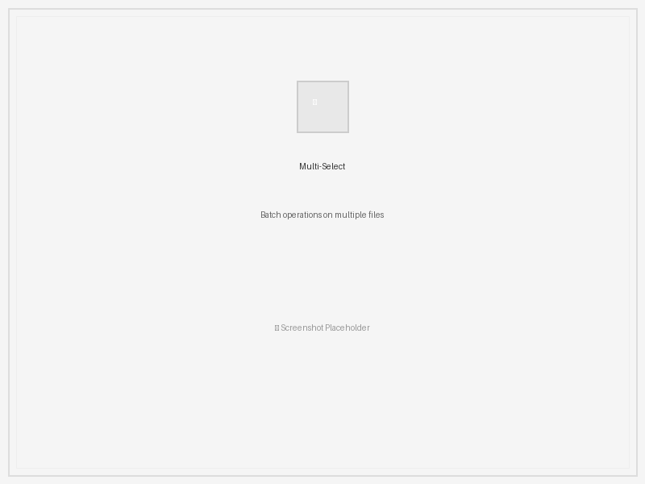
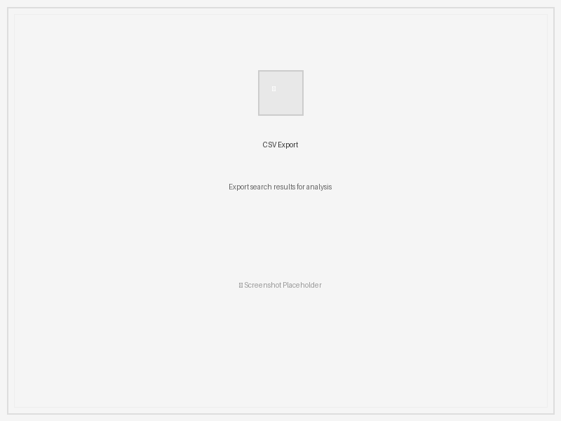

# Everything by mdfind

一款基于 macOS 原生 Spotlight 引擎的极速文件搜索工具，毫秒级响应速度

## 核心功能

Everything by mdfind 为 macOS 用户提供全面而强大的文件搜索体验。

### 🔍 闪电搜索引擎
* **闪电搜索：** 基于 macOS Spotlight 索引技术，文件检索快如闪电
* **双模检索：** 同时支持文件名和文件内容搜索，精准定位目标
* **智能内容索引：** 利用原生 Spotlight 能力搜索文件内容


*简洁直观的界面提供强大的搜索功能*

### 🎛️ 高级搜索控制
* **智能过滤：** 多维度筛选条件组合：
    * 文件大小范围（最小/最大字节数）
    * 指定文件类型（如 `pdf`, `docx`）
    * 是否区分大小写
    * 精确匹配或模糊搜索
* **精准定位：** 支持限定特定目录范围，缩小搜索区域


*高级过滤选项帮助精确筛选搜索结果*

### 📱 多标签页界面
* **多标签页搜索：** 同时进行多个搜索任务：
    * 为不同搜索查询创建独立标签页
    * 右键菜单管理标签：关闭、关闭其他、关闭左侧/右侧
    * 每个标签页独立的搜索结果和设置
    * 类似Chrome的标签页体验，支持拖拽排序和滚动按钮


*直观的标签页系统支持多任务并行搜索*

### 👁️ 全能预览系统
* **全能预览：** 内置文件预览功能支持：
    * 文本文件（自动识别编码）
    * 图片（JPEG/PNG/GIF动画/BMP/WEBP/HEIC）
    * SVG矢量图（自适应缩放+居中显示）
    * 音视频文件（支持播放控制）


*在应用内直接预览图片并显示元数据信息*


*内置视频预览功能，支持完整媒体控制*

### 🎵 媒体中心集成
* **媒体中心：**
    * 集成音视频播放器（标准控制条）
    * 独立播放窗口
    * 连续播放模式
    * 音量调节与静音功能


*集成到搜索结果中的全功能媒体播放器*

### ⚡ 快捷书签入口
* **快捷入口：** 一键直达常用搜索：
    * 大文件（>50MB）
    * 视频文件
    * 音频文件
    * 图片文件
    * 压缩包
    * 应用程序


*常用文件类型的快速书签*

### 📊 强大数据管理
* **灵活排序：** 支持名称/大小/修改时间/路径多维排序
* **批量处理：** 多选文件一键操作：
    * 使用 Shift 或 Command (⌘) 键多选
    * 批量操作：打开/删除/复制/移动/重命名
    * 丰富的右键菜单功能


*选择多个文件进行批量操作*

### 🎨 个性化界面
* **主题支持：** 明暗主题自由切换，适应不同使用环境
* **布局控制：** 根据工作流程显示/隐藏预览面板
* **搜索历史：** 智能自动补全和历史记录管理


*优雅的暗色主题适合弱光环境*

### 💼 专业级功能
* **数据导出：** 支持导出 CSV 格式搜索结果，便于后续分析
* **百万级承载：** 分批加载机制轻松处理海量结果
* **拖拽直达：** 直接拖放文件至其他应用
* **路径操作：** 一键复制完整路径/所在目录/纯文件名，支持可视化确认


*导出搜索结果用于外部分析和报告*

## 快速上手

1. 在搜索框输入关键词
2. （可选）在目录框指定搜索范围，留空即全局搜索
3. 使用筛选器设置文件大小/类型等条件
4. 点击表头切换排序方式（名称/大小/修改时间/路径）
5. 通过"视图"菜单开关预览面板，实时查看文件内容
6. 使用"书签"菜单快速定位特定文件类型（视频/音频/图片等）
7. 使用"书签"菜单快速定位特定文件类型（视频/音频/图片等）
8. 右键点击文件弹出操作菜单
9. 直接拖拽搜索结果到其他应用
10. 媒体文件支持内置播放器或独立窗口播放
11. 每次搜索自动创建新标签页，支持多个搜索任务同时进行
12. 右键标签页使用管理菜单：关闭标签、关闭其他标签、关闭左侧/右侧标签
13. 通过视图菜单切换深色模式，夜间使用更舒适

## 安装指南

1. **运行环境：**
    * Python 3.6 或更新版本
    * PyQt6 图形界面库

2. **获取代码：**
    ```bash
    git clone https://github.com/appledragon/everythingByMdfind
    cd everythingByMdfind
    ```

3. **安装依赖：**
    ```bash
    pip install -r requirements.txt
    ```

4. **启动软件：**
    ```bash
    python everything.py
    ```

## 个性设置

* **深色模式：** 通过视图菜单切换暗色主题
* **搜索历史：**
  - 自动保存最近搜索记录（支持关键词补全）
  - 可在帮助菜单关闭历史记录功能
* **预览功能：**
  - 内置预览面板（支持文本/图片/视频/应用程序）
  - 通过视图菜单控制预览区显示

## 打包独立版（可选）

使用 py2app 生成 macOS 独立应用：

1. **安装打包工具：**
    ```bash
    pip install py2app
    ```

2. **创建配置文件：**
    ```bash
    cat > setup.py << 'EOF'
    from setuptools import setup

    APP = ['everything.py']
    DATA_FILES = [
        ('', ['LICENSE.md', 'README.md']),
    ]
    OPTIONS = {
        'argv_emulation': False,
        'packages': ['PyQt6'],
        'excludes': [],
        'plist': {
            'CFBundleName': 'Everything',
            'CFBundleDisplayName': 'Everything',
            'CFBundleVersion': '1.3.3',
            'CFBundleShortVersionString': '1.3.3',
            'CFBundleIdentifier': 'com.appledragon.everythingbymdfind',
            'LSMinimumSystemVersion': '10.14',
            'NSHighResolutionCapable': True,
        }
    }

    setup(
        app=APP,
        data_files=DATA_FILES,
        options={'py2app': OPTIONS},
        setup_requires=['py2app'],
    )
    EOF
    ```

3. **生成应用：**
    ```bash
    python setup.py py2app
    ```
    生成的 macOS 应用包位于 `dist` 目录

## 贡献代码

欢迎提交 Pull Request 或 Issue 共同完善项目！

## 开源许可

本项目采用 [MIT] 许可证 - 详见 [LICENSE.md](LICENSE.md)

## 开发团队

Apple Dragon

## 当前版本

1.3.3

## 致谢

* 感谢 PyQt6 团队提供的跨平台 GUI 框架
* 致敬优秀开源项目带来的启发


