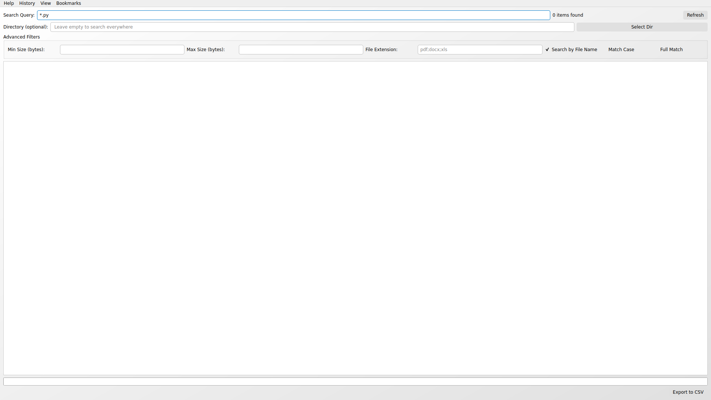
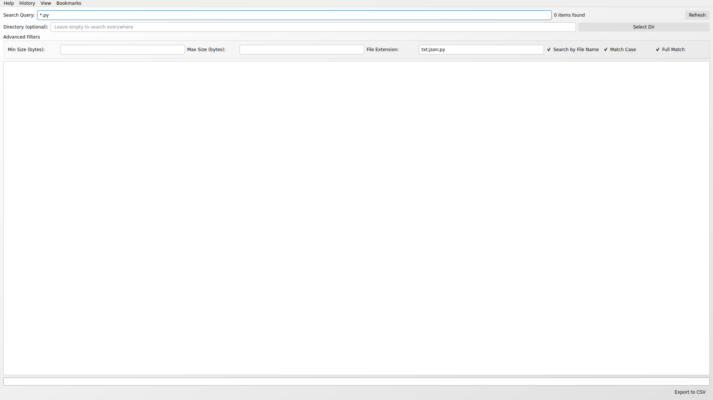
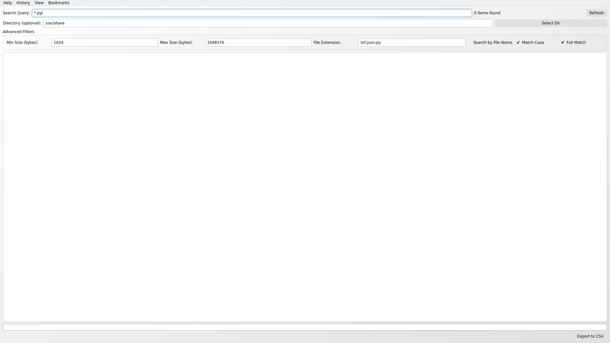
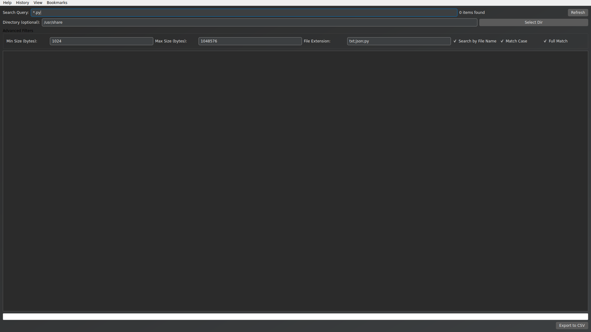
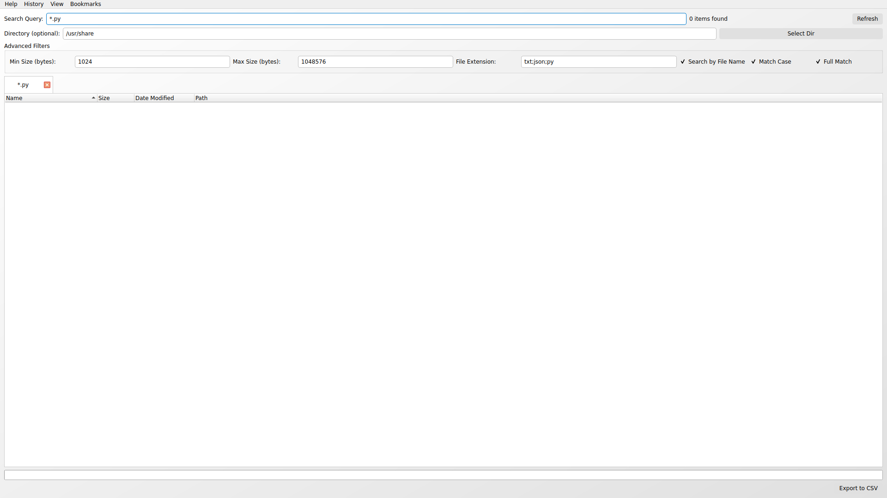
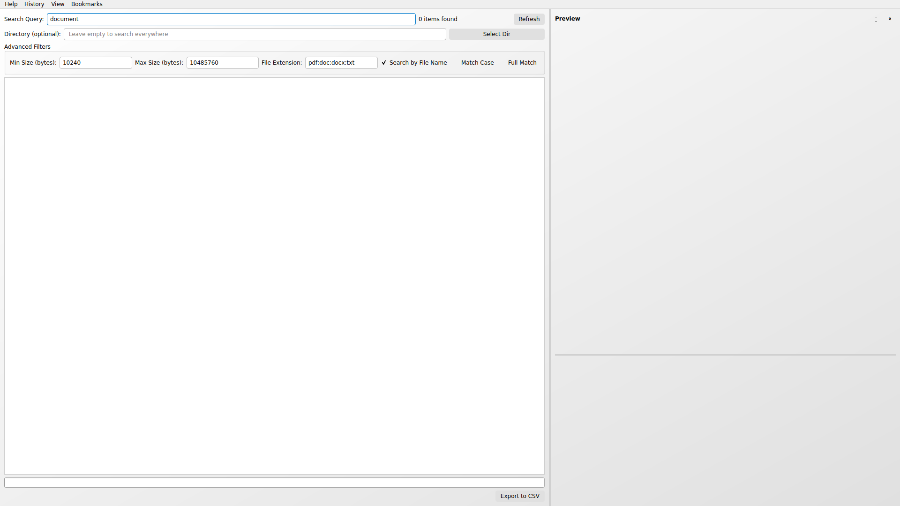

# Everything by mdfind - Screenshots

This directory contains screenshots demonstrating the main features of the Everything by mdfind application.

## Main Interface Features

### 1. Main Interface

*The main application interface showing the search field, advanced filters, and tabbed results area*

### 2. Search Functionality

*Demonstrating file search using wildcard patterns (*.py for Python files)*

### 3. File Extension Filtering

*Advanced filtering by file extensions (txt;json;py)*

### 4. Advanced Search Options

*Case-sensitive and full match search options*

### 5. Directory-Specific Search

*Limiting search to specific directories (e.g., /usr/share)*

### 6. File Size Filtering

*Filtering files by minimum and maximum size in bytes*

### 7. Content Search Mode

*Searching within file contents instead of just filenames*

### 8. Filename Search Mode

*Traditional filename-based search mode*

## Interface Themes

### 9. Dark Mode

*The application in dark mode for comfortable use in low-light environments*

### 10. Light Mode

*The application in light mode (default theme)*

### 11. Bookmarks Menu

*Quick access to common file type searches through the bookmarks menu*

### 12. View Menu Options

*View menu showing theme options, preview toggle, and playback settings*

### 13. Multiple Search Tabs

*Tabbed interface allowing multiple simultaneous searches*

### 14. Comprehensive Search Setup

*All search filters and options configured for a detailed file search*

## Key Features Demonstrated

- **Fast Search**: Leverages macOS Spotlight (mdfind) for lightning-fast results
- **Flexible Filtering**: Multiple ways to refine search results
- **Advanced Options**: Case sensitivity, full match, content vs filename search
- **Directory Scoping**: Limit searches to specific directories
- **File Size Filtering**: Find files within specific size ranges
- **Dual Themes**: Both light and dark modes available
- **Tabbed Interface**: Multiple searches can be performed simultaneously
- **Bookmarks**: Quick access to common file type searches
- **Menu Integration**: Full menu system with all options accessible
- **Export Functionality**: Results can be exported to CSV
- **Real-time Search**: Results update as you type (with debouncing)

## Usage Notes

These screenshots were taken in a demonstration environment. On actual macOS systems, the application would show real search results from your Spotlight index, providing instantaneous access to files across your entire system.

The preview panel (not shown in current screenshots) provides rich previews of various file types including:
- Text files with encoding detection
- Images (JPEG, PNG, GIF, BMP, WEBP, HEIC, SVG)
- Video files with playback controls
- Audio files with media controls

## Installation and Usage

See the main [README.md](../README.md) for installation instructions and detailed feature descriptions.